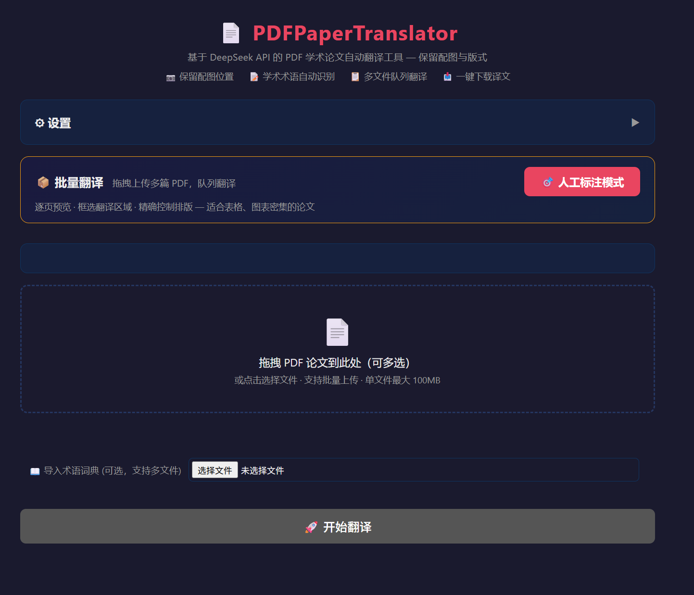
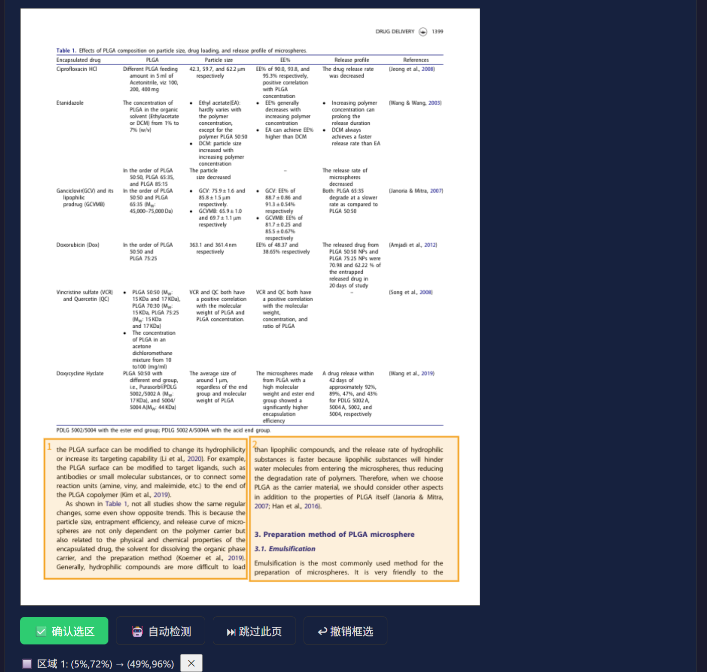

<div align="center">
  <h1>📄 PDFPaperTranslator</h1>
  <p><b>EN → ZH Academic PDF Translator with Layout Preservation</b></p>
  <p>
    <a href="#chinese">🇨🇳 中文</a> &nbsp;|&nbsp;
    <a href="#english">🇬🇧 English</a>
  </p>
</div>

---

<a name="chinese"></a>
<details open>
<summary><b>🇨🇳 中文</b>（点击收起）</summary>

## 📖 目录

- [概述](#概述)
- [关键文件](#关键文件)
- [功能](#功能)
- [使用方法](#使用方法)
- [已知限制](#已知限制)
- [Token 消耗](#token-消耗)
- [界面截图](#界面截图)

## 概述

> ⚠️ **本程序仅支持 DeepSeek API**（`https://api.deepseek.com/chat/completions`），请在 [platform.deepseek.com](https://platform.deepseek.com) 获取 API Key 后填入 `apikey.txt`。不支持 OpenAI / Claude / Gemini 等其他 API。

PDFPaperTranslator 将英文 PDF 学术论文翻译为中文，**保留图片、表格和页面排版**。从 PDF 中提取带位置坐标的文本块，通过 DeepSeek API 批量翻译，并用翻译后的文本在原始位置重建新 PDF。

**两种模式：**
- **批量模式**：拖拽上传多篇 PDF，Web 界面 FIFO 队列翻译
- **人工标注模式**：上传单篇 PDF，逐页预览，框选翻译区域，精确控制排版

**五阶段流水线**：提取 → 分类 → 翻译 → 布局 → 重建

| 阶段 | 描述 |
|------|------|
| 1. 提取 | PyMuPDF 提取文本块（含 bbox 坐标）、图片（→ PNG）、检测表格 |
| 2. 分类 | 文本块分类（正文/标题/图表标题/公式/参考文献）、段落合并、栏目检测 |
| 3. 翻译 | DeepSeek API 批量翻译 + 术语词典累积，并行请求 |
| 4. 布局 | 翻译文本定位适配原始 bbox，自动缩字号，重叠解决 |
| 5. 重建 | reportlab Canvas 渲染图片+翻译文本+表格，输出最终 PDF |

## 关键文件

```
PDFPaperTranslator/
├── __init__.py              # 包入口，导出公共 API
├── __main__.py              # python -m 入口
├── _constants.py            # 全局常量（API URL、阈值、正则模式）
├── cli.py                   # CLI 命令行界面
├── config.py                # API Key / 模型配置管理
├── pipeline.py              # 共享翻译流水线（CLI 和 Web 共用）
├── web_server.py            # Flask Web 服务器 + 翻译队列管理器
│
├── pdf_extractor/           # 阶段1：PDF 内容提取
│   ├── text_extractor.py    #   提取文本块 + bbox 坐标 + 字体信息
│   ├── image_extractor.py   #   提取嵌入图片为 PNG
│   ├── table_extractor.py   #   基于坐标网格检测表格
│   ├── layout_analyzer.py   #   栏检测、文本分类（正文/标题/公式）
│   └── block_grouper.py     #   段落合并、图表标题关联、栏检测
│
├── translation/             # 阶段2&3：翻译引擎
│   ├── api_client.py        #   DeepSeek API 客户端（含 DebugLogger）
│   ├── batch_engine.py      #   核心批量翻译循环，并行子批调度
│   ├── prompt_builder.py    #   提示词模板加载与构建
│   ├── response_parser.py   #   响应解析 + 术语提取 + 混合输出清理
│   ├── term_dict.py         #   增量术语词典管理（线程安全）
│   ├── quality.py           #   源语言字符比例检测 + 术语过滤
│   └── citation_protector.py #  引用占位符保护（⟨CITE_N⟩）
│
├── pdf_reconstructor/       # 阶段4&5：PDF 重建
│   ├── font_manager.py      #   CJK 字体自动查找注册（微软雅黑/Noto等）
│   ├── layout_calculator.py #   布局计算（核心难点：定位+缩字号+重叠解决）
│   ├── page_builder.py      #   Canvas 渲染（图片+文本+区域叠加）
│   └── pdf_writer.py        #   组装输出 PDF（支持跳过页/手动页）
│
└── templates/
    ├── 提示词.txt            #   学术翻译系统提示词
    ├── index.html            #   Web UI 前端（批量模式）
    └── annotate.html         #   Web UI 前端（人工标注模式）
```

## 功能

### 批量翻译模式
- 拖拽上传多篇 PDF，FIFO 队列逐个翻译
- SSE 实时进度推送（提取→分析→翻译→重建）
- 跨文件共享术语词典
- 术语词典导入/导出（JSON 格式）
- 一键 ZIP 下载全部译文
- API 调试日志下载（完整请求/响应+时间戳）
- 可配置跳过指定页面
- 并行翻译加速（48 批/组，24 并发线程）

### 人工标注模式
- 上传单篇 PDF，逐页预览
- Canvas 框选翻译区域（鼠标拖拽画矩形）
- 三种页面模式：手动框选 / 自动检测 / 跳过
- 手动页：擦除框选区域原文 → 填充翻译文本
- 术语词典导入，未导入时弹窗提醒
- 提交后自动跳回主页追踪进度

### 翻译质量
- 引用保护（4 种模式：方括号、括号作者-年份、叙述式）
- 术语词典跨批次累积，确保术语一致性
- 源语言残留检测 → 自动重试
- 参考文献区段自动跳过（不翻译）
- 公式/代码块自动跳过

### 排版保持
- 基于 x 中心点聚类的栏检测
- 字体自动缩小（正文: 10→5pt, 标题: 12→7pt）
- 图片避让 + 同栏重叠解决
- 表格检测 → 裁剪为图片（不翻译）

## 使用方法

### CLI 模式
```bash
cd PDFPaperTranslator
python -m PDFPaperTranslator --pdf paper.pdf                  # 基本翻译
python -m PDFPaperTranslator --pdf paper.pdf --output out.pdf # 指定输出
python -m PDFPaperTranslator --pdf paper.pdf --dry-run        # 仅提取查看
python -m PDFPaperTranslator                                  # 交互模式
```

### Web 服务器（推荐）
```bash
# 双击启动（推荐）
start_web.bat

# 或命令行启动
python web_server.py               # 默认端口 5000
python web_server.py --port 8080   # 自定义端口
```
浏览器打开 `http://127.0.0.1:5000`，人工标注模式点击 🎯 按钮或访问 `/annotate`。

### 配置
- API Key：`apikey.txt`（纯文本）
- 模型：`config.json` — `"deepseek-v4-flash"` 或 `"deepseek-v4-pro"`
- 优先级：命令行 > 配置文件 > 交互输入

## 已知限制(部分可以用人工标注模式绕过)

| 限制 | 说明 |
|------|------|
| 扫描版 PDF | 不支持，需要嵌入式文字层 |
| 三栏布局 | 栏检测仅支持双栏，三栏论文可能误合并 |
| 非英/中图标题 | 德语、法语等 Figure/Table 标题无法识别 |
| 加密 PDF | 不支持 |
| CJK 字体缺失 | 输出显示方块（□） |
| 短公式 | ≤10 字符的公式可能被误翻译 |
| 表格 | 检测到的表格裁剪为图片（不翻译文字） |
| PDF 元数据 | 原始书签、超链接、元数据丢失 |

## Token 消耗

| 指标 | 每 1 万输入字符 | 说明 |
|------|:---------:|------|
| 输入 token |  ~4,000   | 系统提示词 + 用户消息 |
| 输出 token |  ~6,500   | 翻译文本 |
| 总 token |  ~10,500  | 输入:输出 ≈ 1:1.6 |
| 缓存命中率 |  ~55-70%  | 系统提示词全批次相同 |

## 界面截图





</details>

---

<a name="english"></a>
<details>
<summary><b>🇬🇧 English</b> (click to expand)</summary>

## 📖 Table of Contents

- [Overview](#overview-en)
- [Key Files](#key-files-en)
- [Features](#features-en)
- [Usage](#usage-en)
- [Limitations](#limitations-en)
- [Token Consumption](#token-consumption-en)
- [Screenshot](#screenshot-en)

<a name="overview-en"></a>
## Overview

> ⚠️ **DeepSeek API only.** This program exclusively uses the DeepSeek API (`https://api.deepseek.com/chat/completions`). Get your API key at [platform.deepseek.com](https://platform.deepseek.com) and save it to `apikey.txt`. OpenAI / Claude / Gemini and other APIs are NOT supported.

PDFPaperTranslator translates English academic PDFs to Chinese while **preserving images, tables, and page layout**. It extracts text blocks with position coordinates from PDFs, translates them via the DeepSeek API, and reconstructs new PDFs with translated text in original positions.

**Two modes:**
- **Batch mode**: Drag-and-drop multiple PDFs, FIFO queue translation via Web UI
- **Manual annotation mode**: Upload single PDF, preview pages, draw rectangles to select regions

**Five-stage pipeline**: Extract → Classify → Translate → Layout → Rebuild

<a name="key-files-en"></a>
## Key Files

| File | Role |
|------|------|
| `pipeline.py` | Shared pipeline (CLI + Web) |
| `web_server.py` | Flask web server + queue manager |
| `_constants.py` | All global constants, thresholds, patterns |
| `pdf_extractor/` | Text block extraction, image extraction, table detection, layout analysis |
| `translation/` | DeepSeek API client, batch engine, prompt builder, response parser, term dictionary |
| `pdf_reconstructor/` | Font manager, layout calculator, page builder, PDF writer |
| `templates/` | Web UI (batch + annotation modes) |

<a name="features-en"></a>
## Features

- **Batch mode**: Multi-file upload, FIFO queue, SSE progress, term dictionary sharing, ZIP download, debug log
- **Manual annotation**: Page preview, canvas region selection, erase + fill translation, per-page mode control
- **Quality**: Citation protection, term consistency, source-language detection, auto-retry, reference/equation skip
- **Layout**: Column detection, font auto-shrink (10→5pt), image avoidance, overlap resolution, table→image

<a name="usage-en"></a>
## Usage

```bash
cd PDFPaperTranslator
python -m PDFPaperTranslator --pdf paper.pdf           # CLI translate
start_web.bat                                          # Web server (recommended)
python web_server.py --port 8080                       # Custom port
```

Configuration: `apikey.txt` (API key), `config.json` (model selection).

<a name="limitations-en"></a>
## Limitations

Scanned PDFs, encrypted PDFs, 3-column layouts, non-EN/ZH captions, missing CJK fonts, short formulas, and PDF metadata loss.

<a name="token-consumption-en"></a>
## Token Consumption

| Metric | Per 10K input chars |
|--------|:-------------------:|
| Input tokens |       ~4,000        |
| Output tokens |       ~6,500        |
| Total tokens |       ~10,500       |
| Cache hit rate |       ~55-70%       |

<a name="screenshot-en"></a>
## Screenshot


</details>
